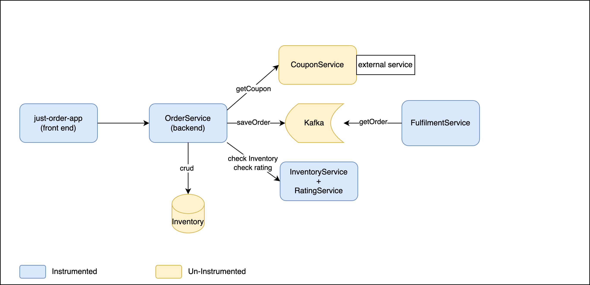

# Lab Application Architecture

|**Application(with agent)** |**Description**|
| ------------- |-------------|
| **Just-Order-App**      | ReactJS singe page app
||interact with OrderService|
||order phone    |
||manage inventory|
| **OrderService**      | Java SpringBoot App    |
||Kafka producer|
||REST APIs/Basic authentication service|
||REST APIs/order|
||REST APIs/vendor-details checking|
| **InventoryService/RatingService**     | Java SpringBoot App    |
||return 410/501 when quantity>400 and >500, return 200 otherwise|
||RatingService/returns between rating number between 7 to 10 randomly|
|**FulfilmentService**|Java SpringBoot app|
||Kafka consumer, listen Kafka “order-topic” and process the order|
||Non-web transaction|
|_External Service(no agent)_ ||
|**CouponService**|Java SpringBoot App|
||If the vendor is “apple”, return 418 response code|
|**Mysql database**|hosting inventory data, Docker-Compose|
||Inventory data schema will be reloaded upon restart|
||Inventory data will not persist upon restart |
|**Kafka instance**|hosting order data,Docker-Compose|
||“order-topic” will be created upon OrderService stratup|

