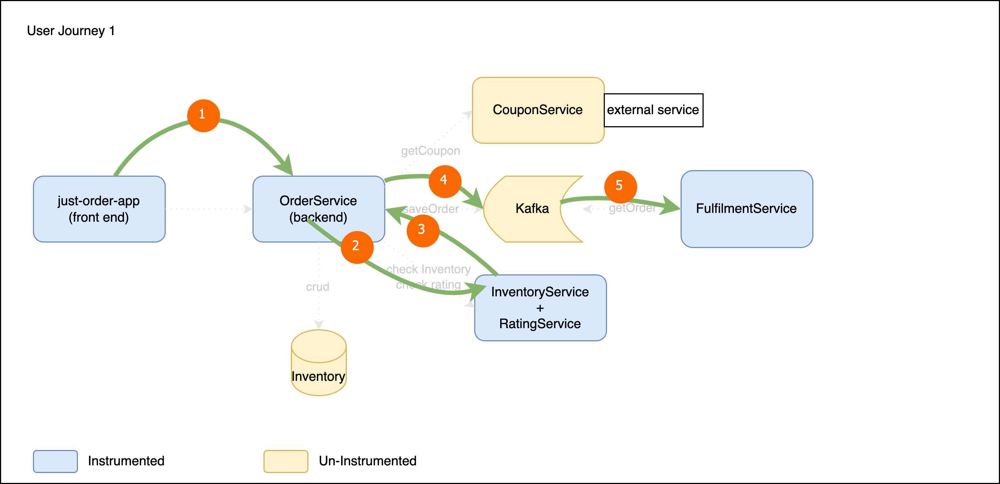

# Lab Application Architecture
#### User Journey 1
 User login -> Order -> Inventory Check -> Kafka producer -> Kafka Consumer

#### User Journey 2
 User login -> Order Phone -> getCoupon( call couponService, call RatingService) -> Order -> Inventory Check -> Kafka Producer -> Kafka Consumer
 

#### User Journey 3
 User login -> Order Phone -> Add New Product 
