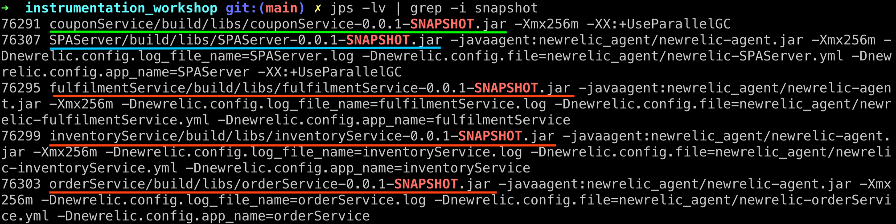
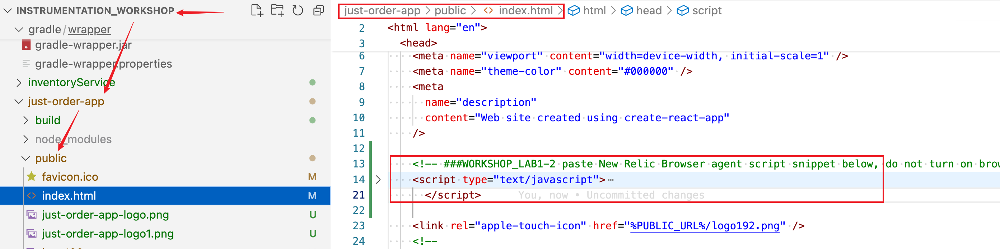

### lab 1-1: Enabling APM Agent 

- Open `inst_apps.sh` in VSCode, find the JVM startup option, enable newrelic javaagent
    > search for **WORKSHOP_LAB1**  
    > uncomment the 4 lines with JVM options settings for the apps

    

- restart all the apps 
    ```
    ./inst_apps.sh restart all
    ```
- run the following command to check JVM options 
    ```
    jps -lv | grep -i snapshot
    ```

   The following three applications should have JVM option `-javaagent` and other system property settings: 
    - fulfilmentService    
    - inventoryService
    - orderService

        

    ```
    SPAServer app is serving `just-order-app` front end as a web server.  
    The purpose having Java agent is to demonstrate the garbage collector `-XX:+UseParallelGC` effect later.
    
    couponServie is an external service. It does not have `-javaagent` as expected. 
    ```


### lab 1-2: Enable Browser Agent for `just-order-app` SPA frontend 
- Add "Browse Monitoring" using per guided `Add data` wizard
    
- Choose the default options as shown in the following sreenshots
    
    

- Copy the "Browser agent snippet" by clicking `Copy to clipboard` 
- Paste the snippet to `just-order-app` frontend index.html (search "WORKSHOP_LAB1-2")
    

- Rebuild the `just-order-app` Reactjs app in `instrumentation_workshop/just-order-app` folder
  ```
  npm run build
  ```
    

- Restart SPAServer in `instrumentation_workshop` folder

    ```
    #
    ./inst_apps.sh restart SPAServer
    ```
