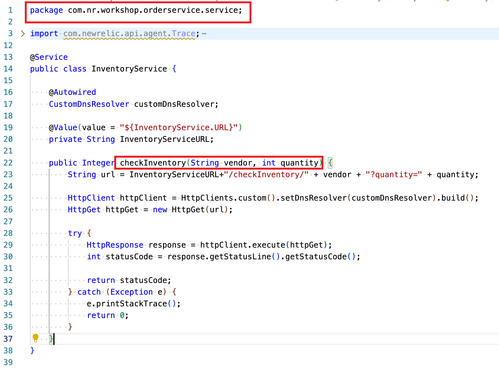
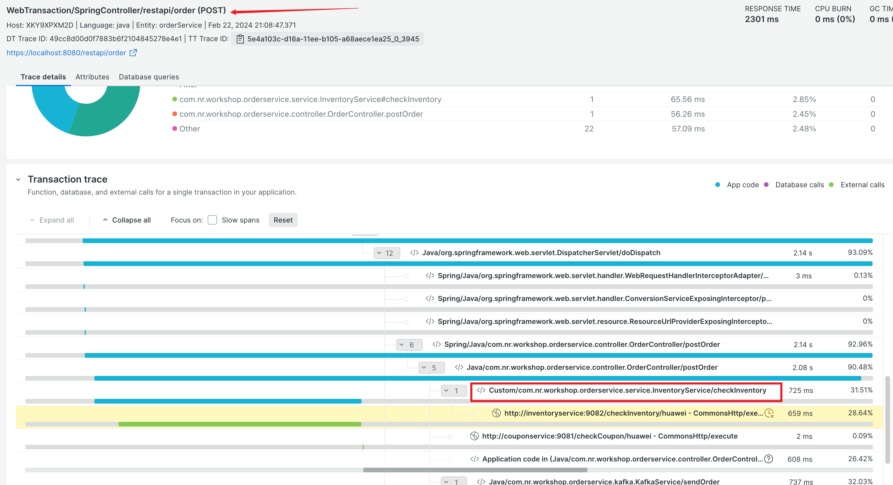

### Using XML to instrument method

- Instrumentat the following method of the class: 

      

- Create xml file `checkInventory_instrument.xml` in <newrelic-agent/extensions> folder. The xml name can be any arbitrary name.

    ```XML
    <?xml version="1.0" encoding="UTF-8"?>
    <extension xmlns="https://newrelic.com/docs/java/xsd/v1.0" xmlns:xsi="http://www.w3.org/2001/XMLSchema-instance" xsi:schemaLocation="newrelic-extension extension.xsd" name="extension-example" version="1.0" enabled="true">
    <instrumentation>
        <pointcut transactionStartPoint="false" ignoreTransaction="false">
        <className>com.nr.workshop.orderservice.service.InventoryService</className>
        <method>
            <name>checkInventory</name>
            <parameters>
            <type attributeName="">java.lang.String</type>
            <type attributeName="">int</type>
            </parameters>
        </method>
        </pointcut>
    </instrumentation>
    </extension>

    ```

- It is not required to restart Java agent. Generate order transaction, validate the `checkInventory` is part of the transaction trace.  
    > `checkInventory` is inside orderService application.  
 

     
