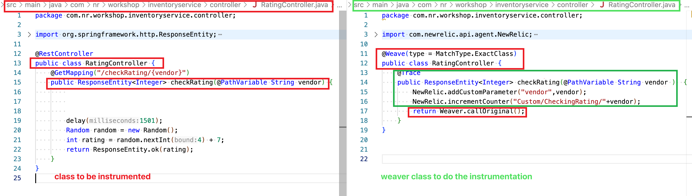
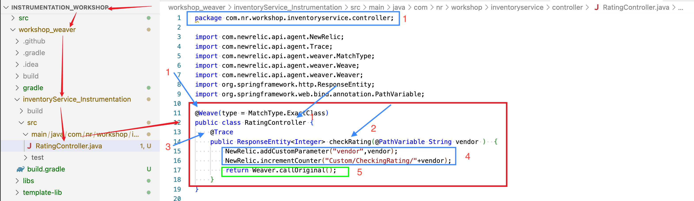
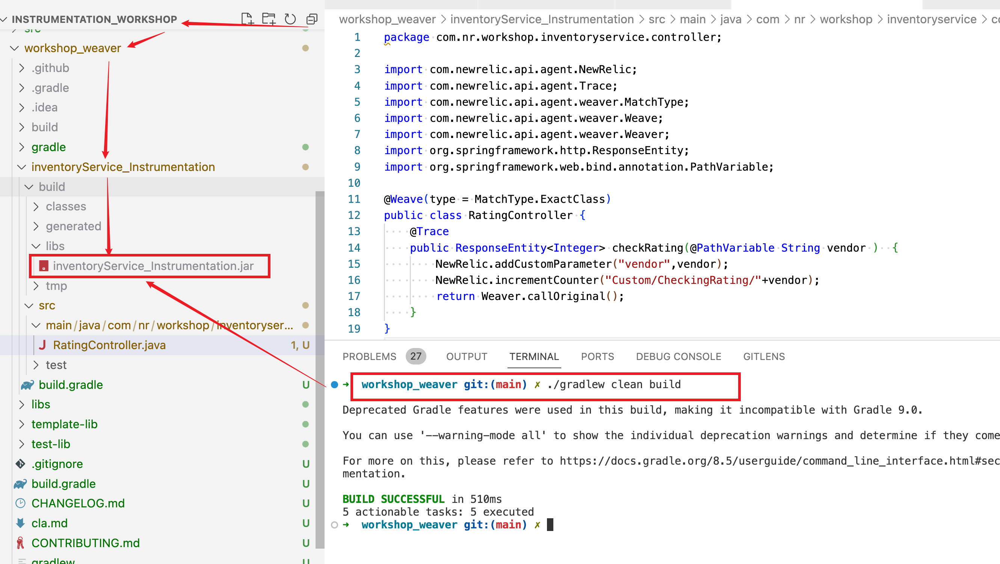
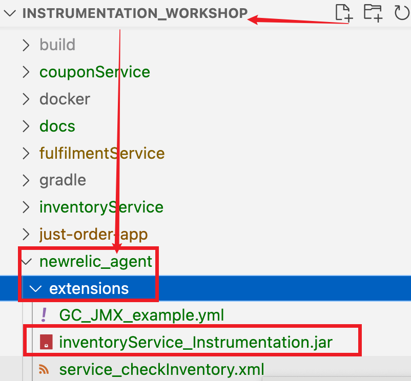
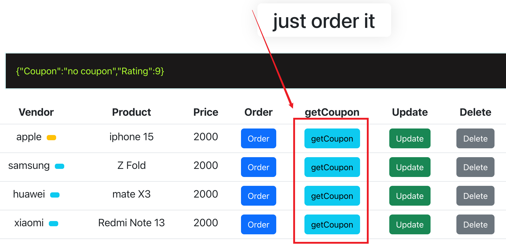
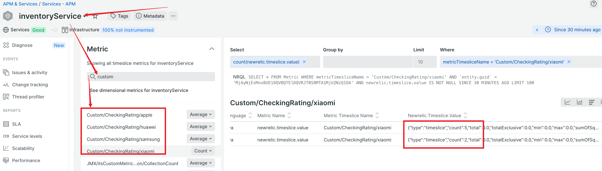

### Using Weaver to instrument inventoryService -> RatingController.checkRating

- Class and method to be instrumented 

    

  > You want to add custom attribute `vendor` to track vendor.   
  > You also want to add metrics to keep track how many times the `checkRating` being called per vendor.  

  ```
        NewRelic.addCustomParameter("vendor",vendor);
        NewRelic.incrementCounter("Custom/CheckingRating/"+vendor);
  ```

- Class to be instrumented(**left**) vs Weaver Class(**right**) to do the instrumentation

    


- A Weaver project is already created for the above instrumentation

    

- Run Gradle build to build the instrumentation module jar file

    **In `instrumentation_workshop/workshop_weaver` folder**
    ```
    ./gradlew clean build

    ```

     


- Copy the `build/libs/inventoryService_Instrumentation.jar` instrumentation module to <newrelic-agent/extensions> folder. 
  
    

  The Java agent should pick up the instrumention automatically. 
  
  You can also restart apps manaully to force the agent to fresh load the extension. 

- Generate `getCoupon` activities, validate the metrics are being

    

     

---
## The END 


