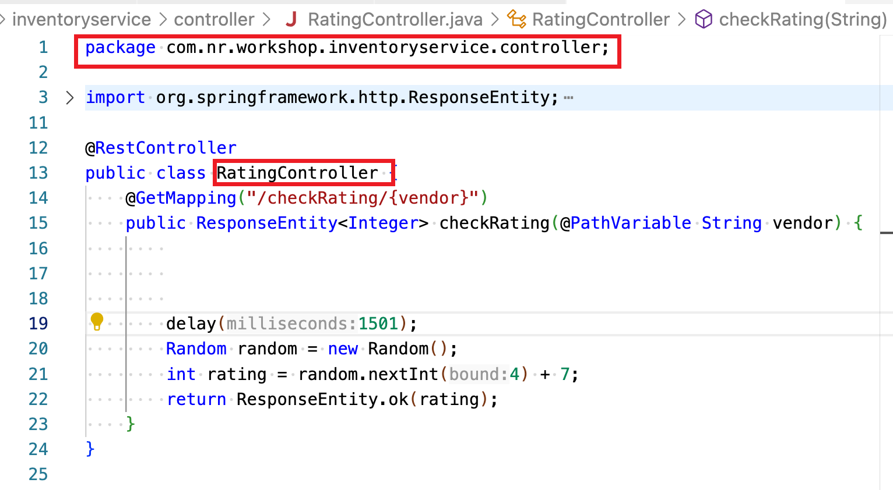

### Using Weaver to instrument inventoryService -> RatingController.checkRating

- Your team does not own `inventoryService` application source code. However, the business has the following requirements:    

  > 1. to keep track of the `vendor` info for which the `checkRating` being called   
  > 2. to keep track how many times the `checkRating` being called per vendor   

- You do have access to the jar file of the application and you identify the class and method where you can capture the required metrics.   

    

- NR Weaver instrumentation allows you to create a mirrored class which merges into application's(e.g. `inventoryService`) class (e.g. `RatingController`) during runtime. 

- A Weaver project(`workshop_weaver`) is created to meet the above requirements.   
  > Weaver instrumetation by itself is a seperate workshop  
  > The purpose of this lab is to illustrate the basic concept of Weaver instrumetation  

  
- In the `workshop_weaver` project(included in this package), a dedicate module `inventoryService_Instrumentation` is created to do weaver instrumentation for `inventoryService` application. In this `inventoryService_Instrumentation` module : 

  > - A mirrored class **com.nr.workshop.inventoryservice.controller.**`RatingController` is created with `@Weave` annotation (1)  
  > - The `checkRating` method in the mirrored class matches the `checkRating` method signature in the application's class (2) 
  > - `@Trace` annotation added to the `checkRating` method (3) 
  > - The following code is added to achieve the requirements  (4)
  >  ```
  >      NewRelic.addCustomParameter("vendor",vendor);
  >      NewRelic.incrementCounter("Custom/CheckingRating/"+vendor);
  >  ```
  > - The `return Weaver.callOriginal();` indicates the original `checkRating` code is called after the above code (5)

    


- Side by side comparision of the class to be instrumented(**left**) vs Weaver Class(**right**) does the instrumentation

    

- The merged(weaved) class (e.g. `RatingController`) during runtime is sort of like the following:   
  > The code in the red box comes from weaver class   
  > The code in the blue box comes from the original application class   

    

- Run Gradle build to build the instrumentation module jar file

    **In `instrumentation_workshop/workshop_weaver` folder**
    ```
    ./gradlew clean build

    ```

     


- Copy the `build/libs/inventoryService_Instrumentation.jar` instrumentation module to <newrelic-agent/extensions> folder. 
  
    

  The Java agent should pick up the instrumention automatically. 
  
  You can also restart apps manaully to force the agent to fresh load the extension. 

- Generate `getCoupon` activities, validate the metrics are being

    

     

---
## The END 


