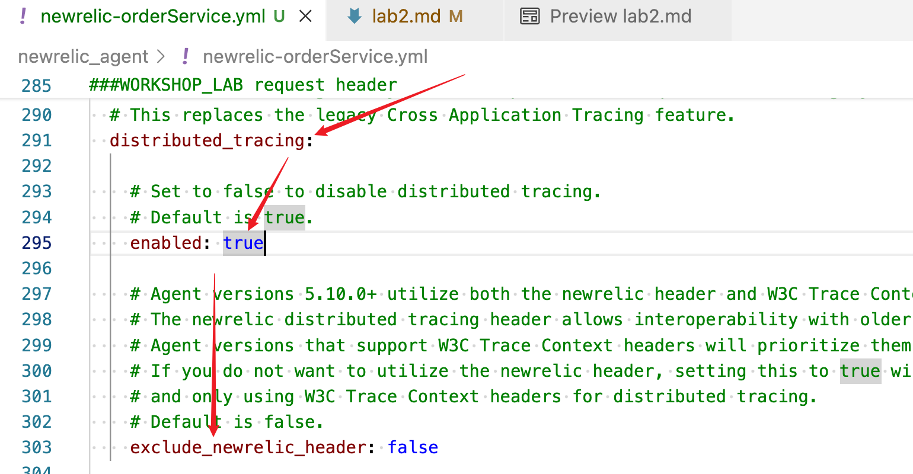

#### lab2-1 Enable DT and Kafka Instrumentation(producer)
- Verify Distribute Tracing is enabled (it is on by default)
    
- Enable Kafka client(library) instrumentation in newrelic config yml for orderService `newrelic_agent/newrelic-orderService.yml`
    
- Restart orderService for the change to take effect
    

- Generate new order traffic and verify the DT header is now injected by the instrumentation
    

#### lab2-2 Enable DT and Kafka Instrumentation(consumer)

- Kafka consumer requires manual instrumentation
    

- Rebuild just `fulfilment` app or simply all the apps
    ```
    ./gradlew :fulfilmentService:build

    or 

    ./gradlew build

    ```
    

- Restart just `fulfilment` app or simply all the apps for the change to take effect
    ```
    ./inst_apps.sh restart fulfilmentService
    or
    ./inst_apps.sh restart all    
    ```

- Genereate some order traffic and validate distributed trace in New Relic UI
    If all works well so far, you should see the following in DT for order transaction, with 3 instrumented entities and 1 external entity
    

#### TroulbeShooting  
- Check fulfilmentService log to verify it processes the order message and the header contains `newrelic` key. 
    ```
    tail -f  applogs/fulfilmentService.log
    ```
- look for log entry starting with "WORKSHOP_LOG"

    