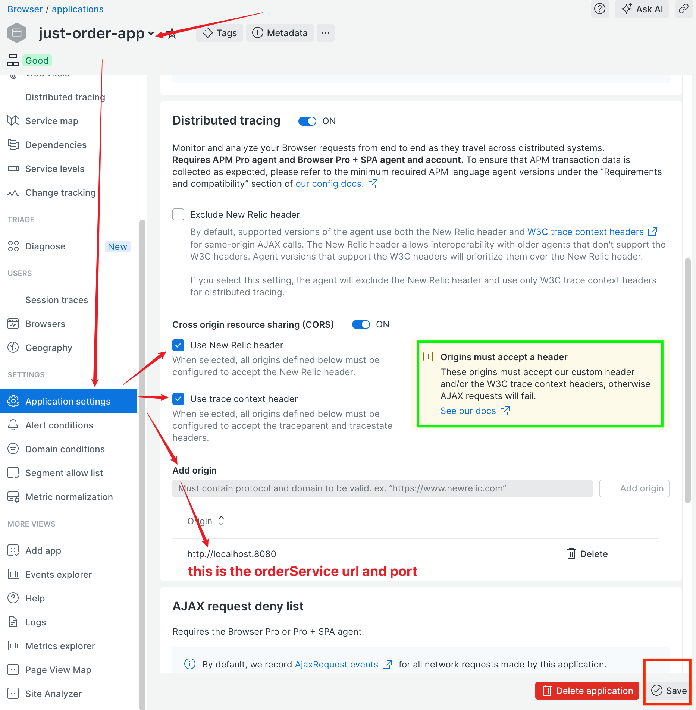
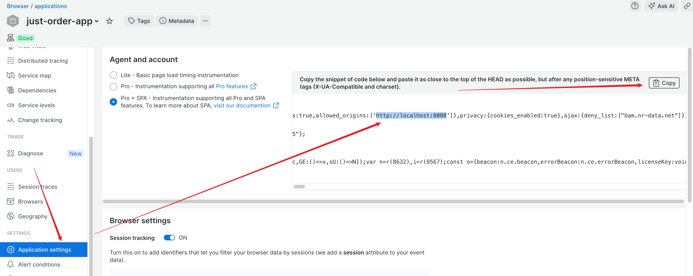
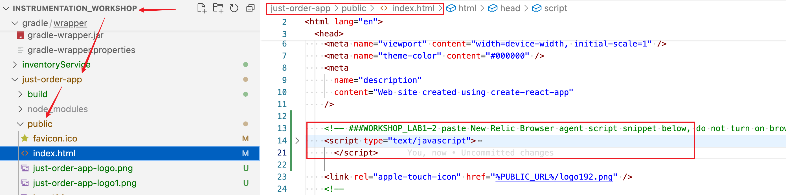
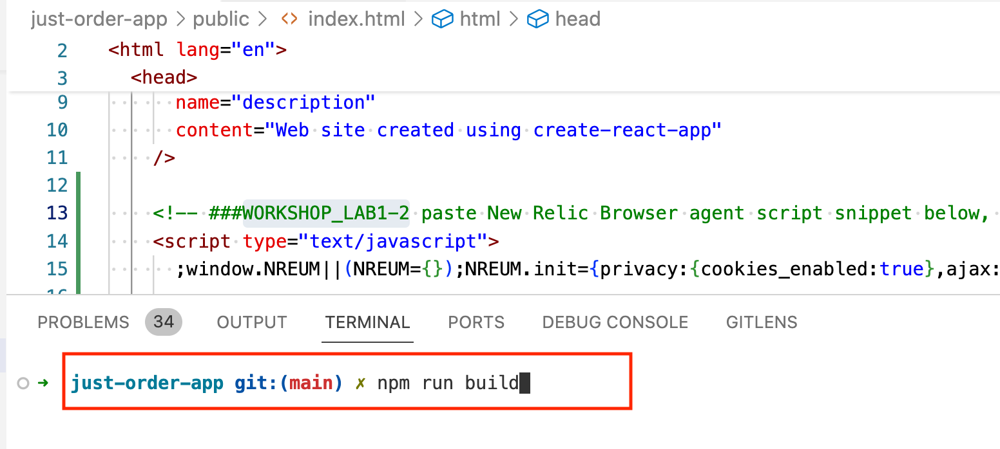
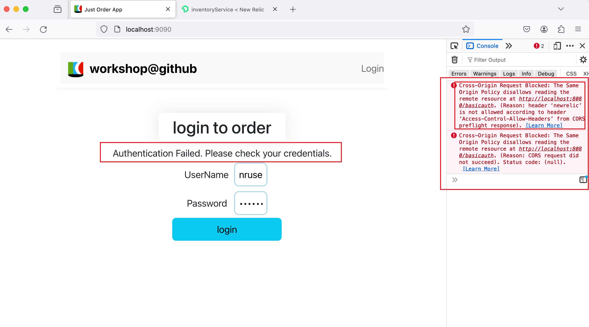
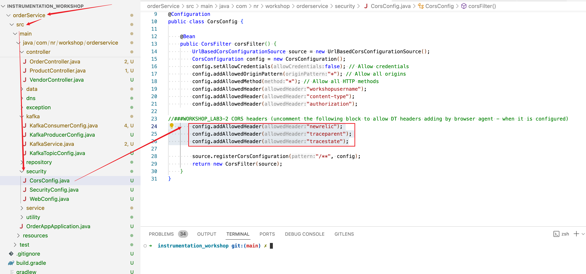
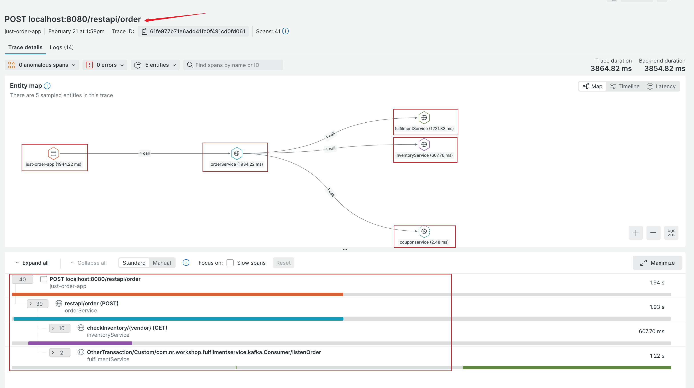

#### lab3-1 Enable DT header and origin for `just-order-app` Browser Agent

- In New Relic UI, locate Browser app `just-order-app`. Check the options for headers and `Add origin` as follows: 
    

- Click "Save" button to save the changes

- Refresh the `Application Settings`, verify the origin and header is updated in the snippet, `Copy` the updated Browse Snippet 

    

- Paste the snippet to `just-order-app` frontend index.html (search "WORKSHOP_LAB1-2")
    

- Rebuild the `just-order-app` Reactjs app in `instrumentation_workshop/just-order-app` folder
  ```
  npm run build
  ```
    

- Restart SPAServer in `instrumentation_workshop` folder
    ```
    #
    ./inst_apps.sh restart SPAServer
    ```

#### lab3-2 Frontend failed with CORS error  
 **You will need to update `orderService` backend to allow CORS**

- You notice user is unable to login to `just-order-app` frontend. Open Browser developer tool, you should see Cross-Origin Request Blocked error.
    

- Update  `orderService` backend to allow the following DT headers
    - newrelic
    - traceparent
    - tracestate 
    
    

- Rebuild just `orderService` app or simply build all the apps
    ```
    ./gradlew :orderService:build

    or 

    ./gradlew build

    ```

- Restart just `orderService` app or simply restart all the apps for the change to take effect
    ```
    ./inst_apps.sh restart orderService
    or
    ./inst_apps.sh restart all    
    ```

- User should be able to login successfully
- **Generate some order traffic, check the distributed tracing**  
   If all works well, you should see a full frontend to backend distributed tracing like below. 

    