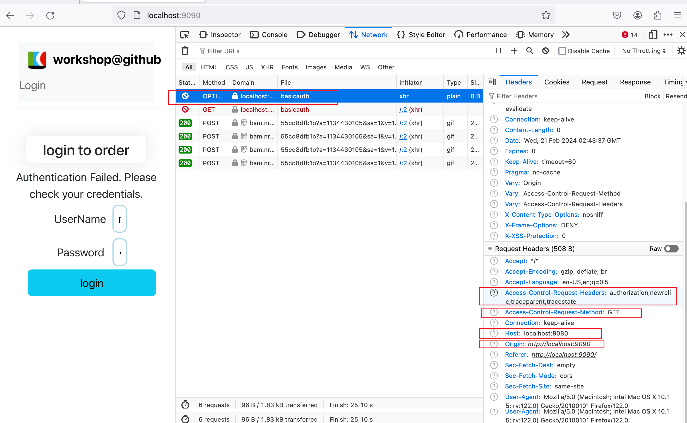

### Tips: 
#### Frontend fails right after the Brower agent snippet update (DT headers and Origin)
- What does the result of `Add Origin` imply? 
- What triggers the CORS error? 

#### Browser preflight request 
(check `network` tab in Browser developer tool when frontend fails)

- What headers is it requesting?
- What method is it requesting? 
- What is the host and port? 
- What is the origin URL and port? 
- What does Browser behave this way? 
- Will you run into CORS issue if the request comes from NodeJS script? 

    