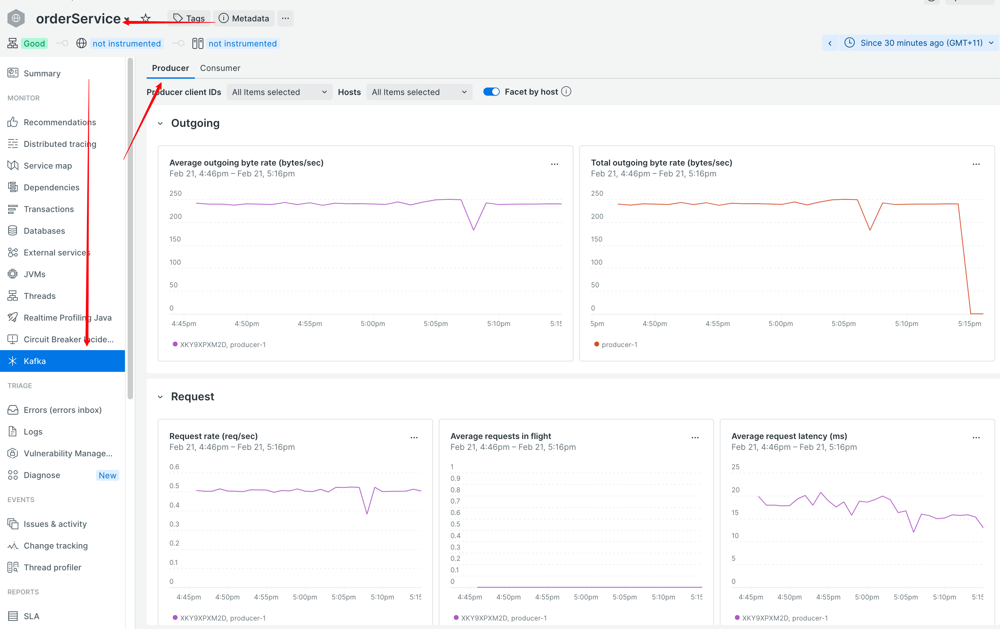
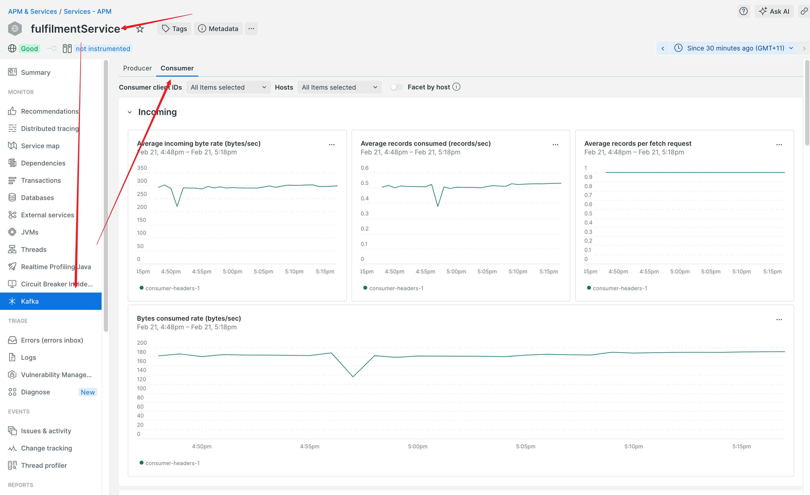
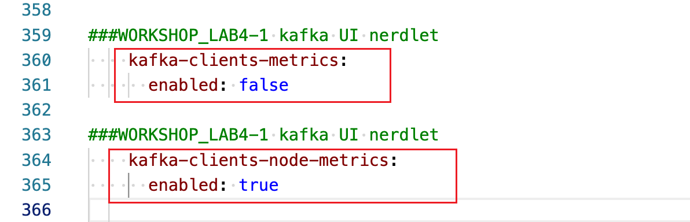

#### lab4-1 Light up `Kafka` nerdlet in APM UI  
This lab will be quick. 

- To light up `Kafka` nerdlet for both producer(orderService) and consumer(fulfilmentService)  

 

 

- Configure the following in newrelic yml on both producer and consumer  

 

