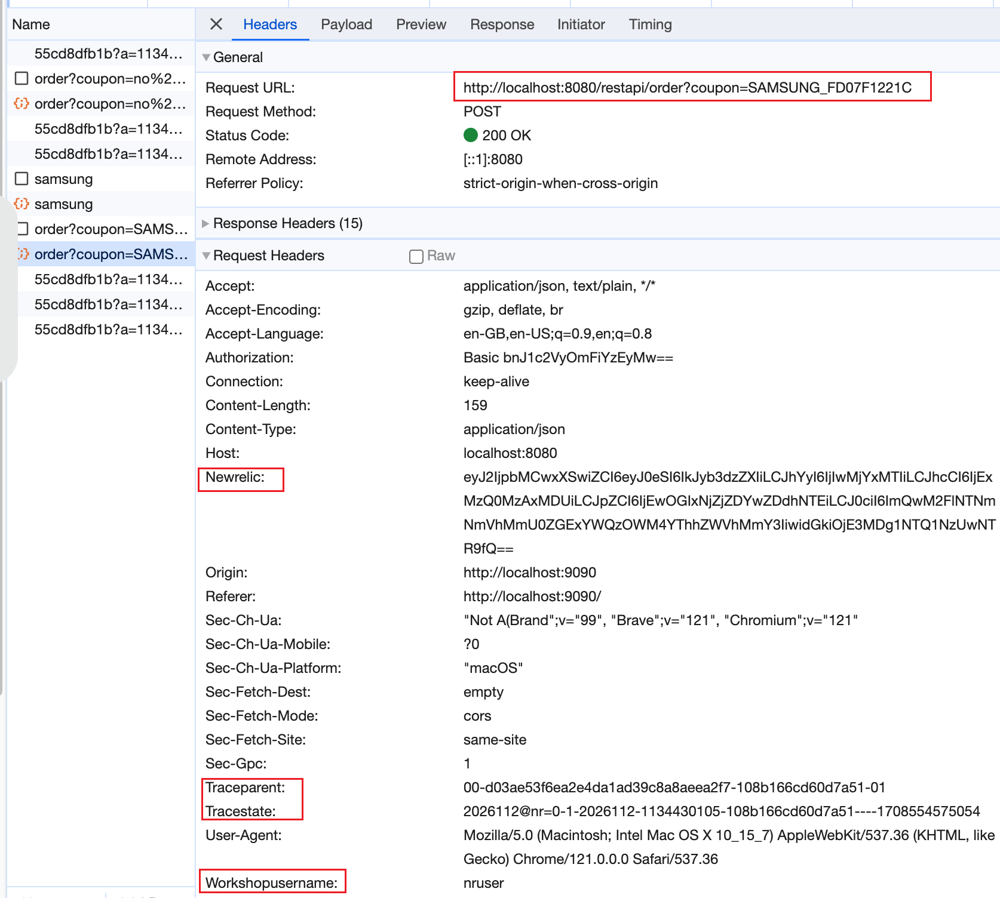
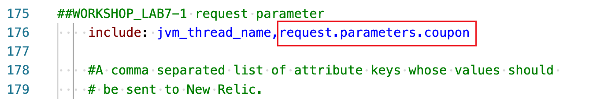
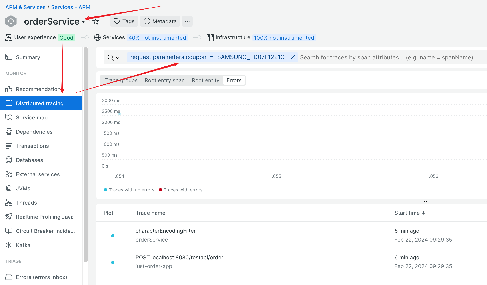

### lab 5-a-1 Capture custom attributes from request parameters

- When frondend post a order to `orderService` backend service, it sends `coupon` as a request parameter along with other data.  

    

- To capture request parameter `coupon`, update newrelic yml config file `newrelic-orderService.yml` as follows: 

    

- Restart `orderService` application or simply all the application

    ```
    ./inst_apps.sh restart orderService
    or
    ./inst_apps.sh restart all    

- Generate order traffic with coupons, validate the `request.parameters.coupon` is captured
    
    
