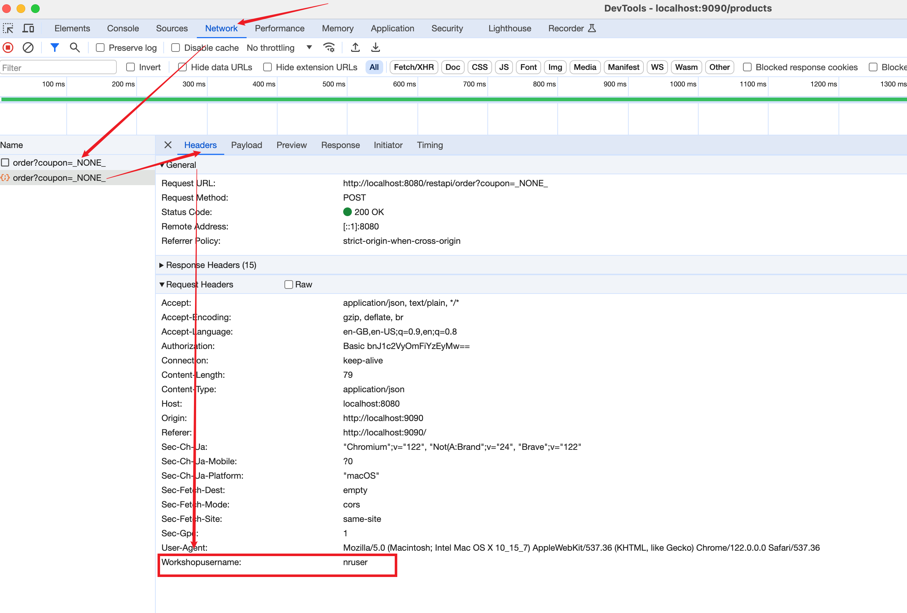

### lab 5-a: Capture Request Header

- By default, Java agent captures the following request and response headers. 

    - request.headers.referer
    - request.headers.accept
    - request.headers.contentLength
    - request.headers.host
    - request.headers.userAgent
    - response.headers.contentType    

- `just-order-app` sends `workshopusername` in each request header.   

   The following is an example of the `order` request in Browser developer console. 
 
      

   To capture `workshopusername` in request header as custom attribute, config newrelic yml. 

    

- restart `orderService` application or simply all the application

    ```
    ./inst_apps.sh restart orderService
    or
    ./inst_apps.sh restart all    
    ```

- Generate new order traffic from `just-order-app` frontend app 

- verify `workshopusername` is captured as `myLoginUsername`  

    **In Transaction Trace**
    

    **In Transaction Trace**
    

    **In Error**
        