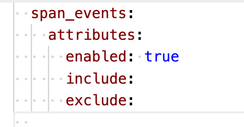

### Configure attributes: Enable, include, and exclude 

- You can configure which types of attributes, or which specific attributes, the Java agent reports to New Relic. 
- This is often done for security reasons, when there are certain sensitive attributes you don't want reported to New Relic.

- Sample attribute filtering for span_events  

    