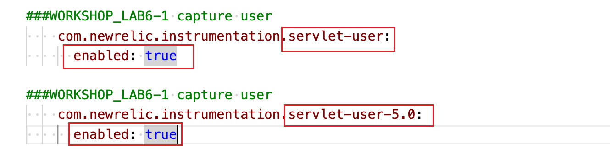
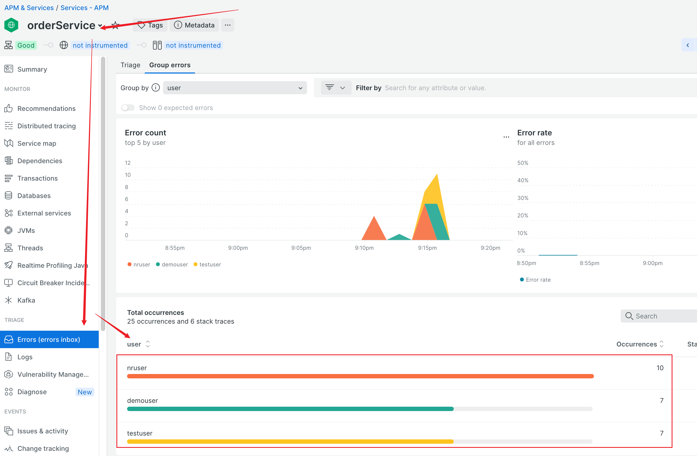
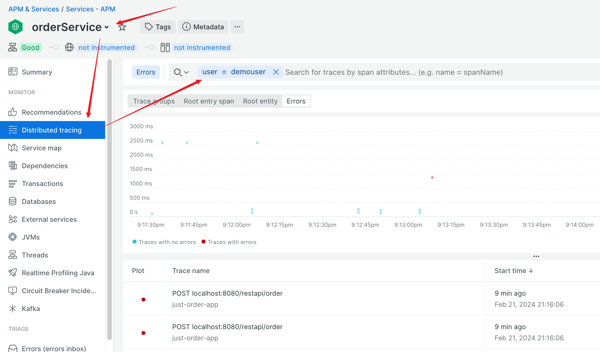
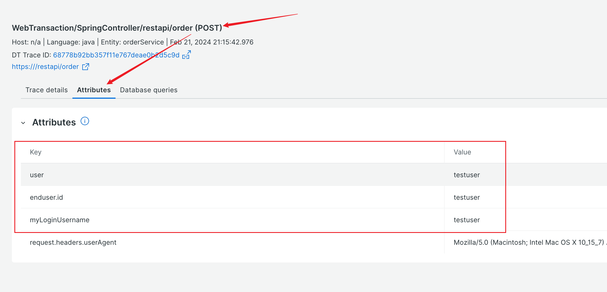

### lab 6-1 Collect user attributes via our servlet instrumentation

- `orderService` is servlet based service. To capture user info from servlet based service, update newrelic yml config file `newrelic-orderService.yml` as follows: 

    

- Restart `orderService` application or simply all the application

    ```
    ./inst_apps.sh restart orderService
    or
    ./inst_apps.sh restart all    
    ```

- Generate order traffic for both with and without errors, validate the user info is captured
    
    **In Error**
    

    **In distributed tracing**
    

    **In transaction trace**
    