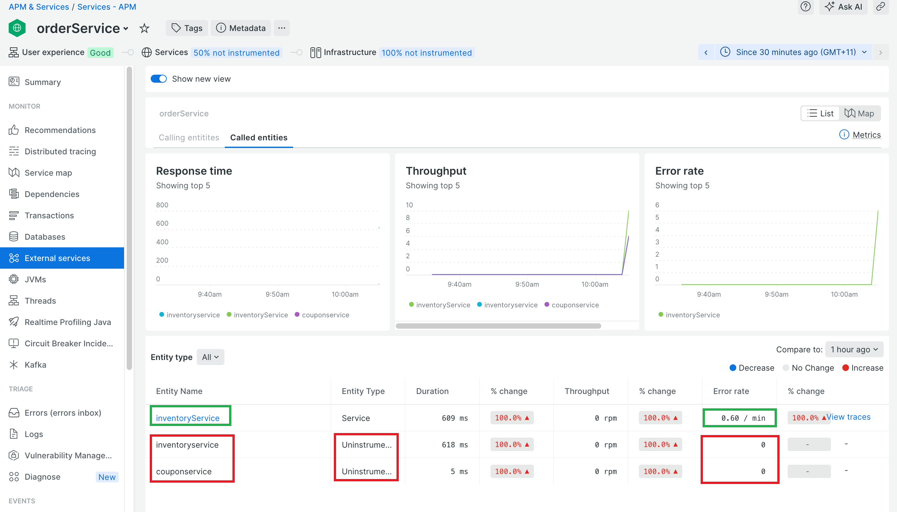
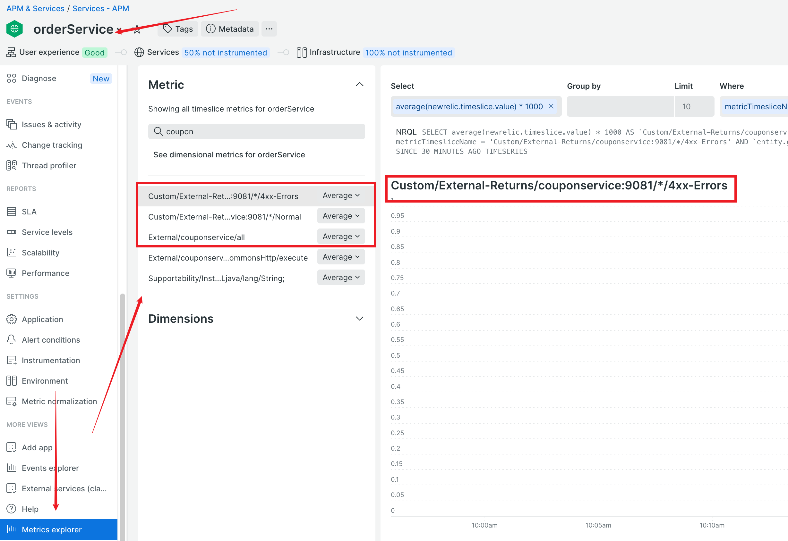

### lab 7-1 Capture external service call errors

- Under `External Service`, the `Error Rate` has no data for `Uninstrumented` external services.

    

- Let's capture error metrics for those `External Service`  
  > We won't be able to populate the `Error Rate` for `Uninstrumented` services  
  > User can create dashboard to present the error metrics 

  > We capture error metrics by instrumenting the libraries used to make the external calls   
    
  > **Detailed instruction at the following repo**   
  > [custom-external-service-error extension ](https://github.com/haihongren/custom-external-service-error)

  For this lab, the extension `httpclient-4.0-custom.jar` is included in the lab repo under `newrelic-agent/` folder.   
  Copy `httpclient-4.0-custom.jar` to `newrelic-agent/extensions` folder.

- Generate `getCoupon` activity for `apple`. 

  If all works well, you should get the error metric for `couponservice`

   
 

