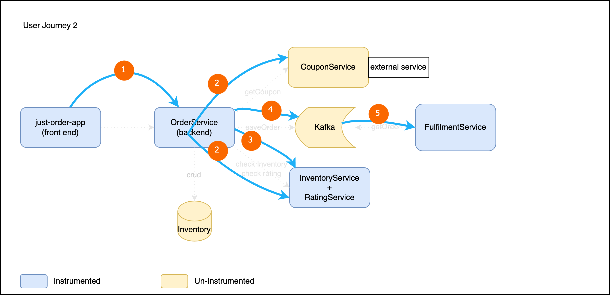
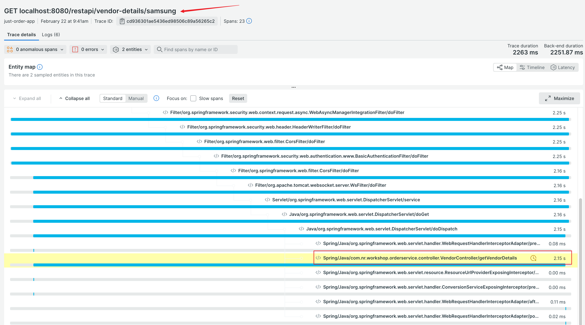
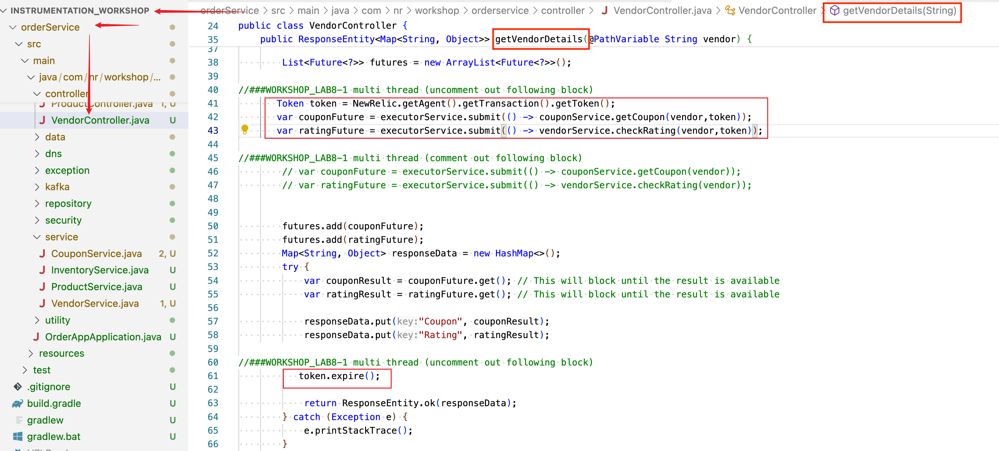
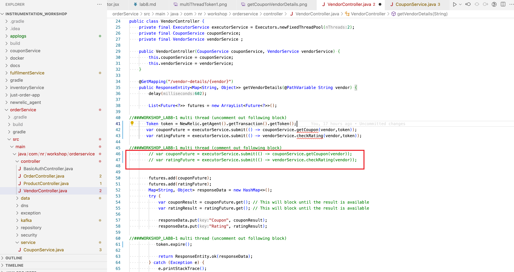
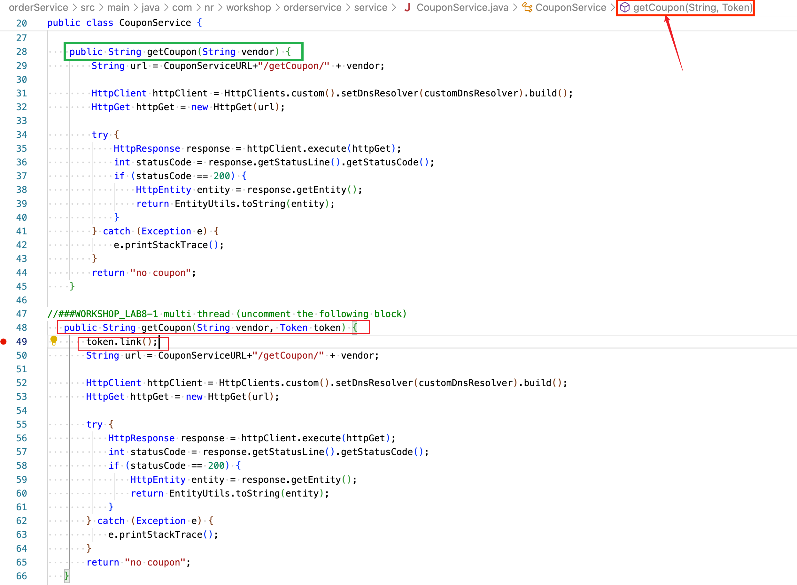
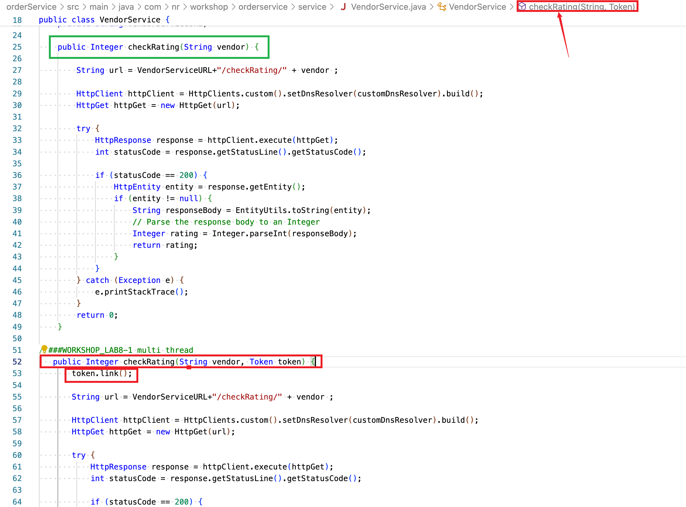
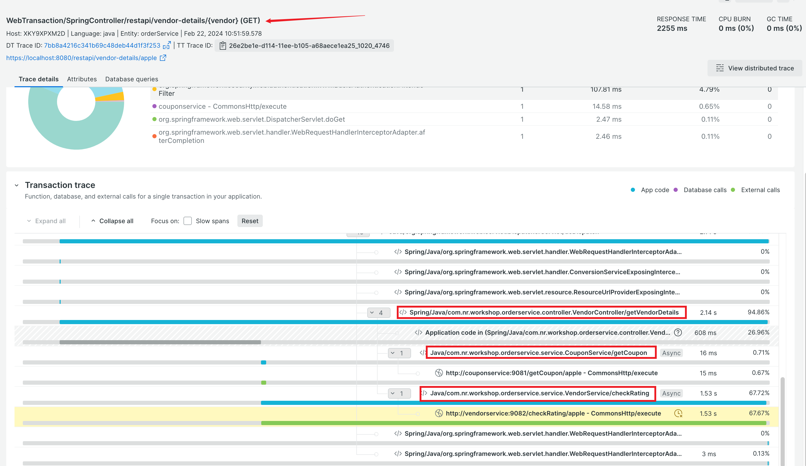

### Multithread and transaction token
- In user journey 2 flow, when user clicks `getCoupon`, two concurrent calls are made to two separate services using two different threads. 

 **User login -> Order Phone -> getCoupon( call couponService, call RatingService) -> Order -> Inventory Check -> Kafka Producer -> Kafka Consumer**

   

- The distributed tracing does not capture the two calls. 

   

-  We will link them back to the transaction using transaction token. 
    - The method starts the two calls is `getVendorDetails` in VendorController class. 
    - This is the transaction context where we need to generate the `token` and pass it on to the method running in new thread.
    - It calls the other two services using respective service components - those services need to be updated to handle/link the `token`.  
    - The `executorService` is the one calling the other services in a new thread.   
    

    **vendorController**
    > search for WORKSHOP_LAB8  
    > uncomment the lines shown in the screenshot  

     

    > search for WORKSHOP_LAB8  
    > comment the lines shown in the screenshot  
    
      

    - Here are the two service components.   
        - The green box is the original method which does not handle `token`. 
        - Developer will add new method(in red box) to handle `token` 
    
    **couponService**
    

    **ratingService**   
    

- Rebuild just `orderService` app or simply all the apps
    ```
    ./gradlew :orderService:build

    or 

    ./gradlew build

    ```

- Restart just `orderService` app or simply all the apps for the change to take effect
    ```
    ./inst_apps.sh restart orderService
    or
    ./inst_apps.sh restart all    
    ```

- Genereate some `getCoupon` traffic and validate transaction trace in New Relic UI.  

    If all works well, you should see the two missing `segments`. 

    

