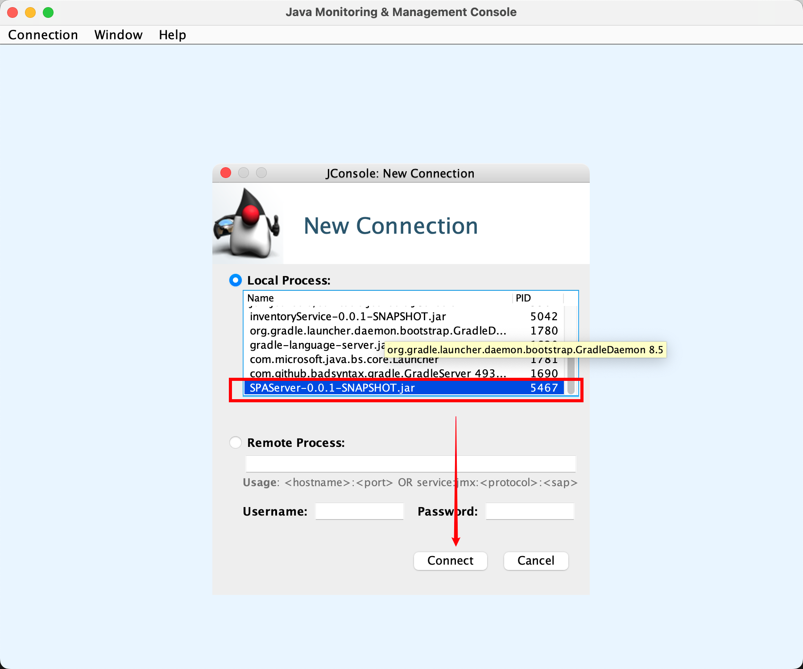
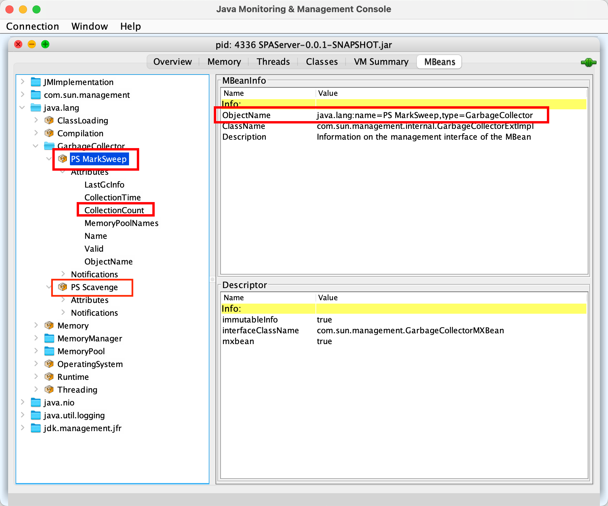
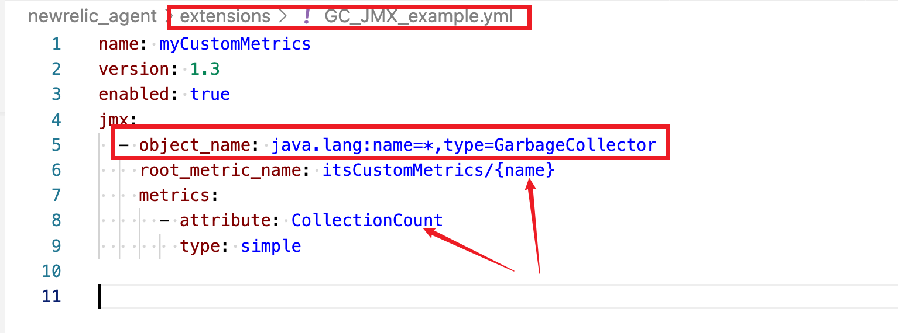
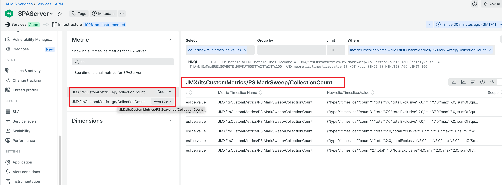

### Using Java Agent built-in JMX to collect GC metrics 

- Identify the JMX metrics in `Jconsole`(comes with JDK) or other similar tools
    ```
    #start Jconsole from terminal
    jconsole 
    ```

     

 
- Take note of the ObjectName and attribute name

     


- Create a yml file (e.g. GC_JMX_example.yml), save it to `<newrelic agent>/extensions` folder. 
    - wildcard(*) can be used
    - {name} property reference 
    - `root_metric_name` prefix

    


- Validate the metrics are being collected.

    
