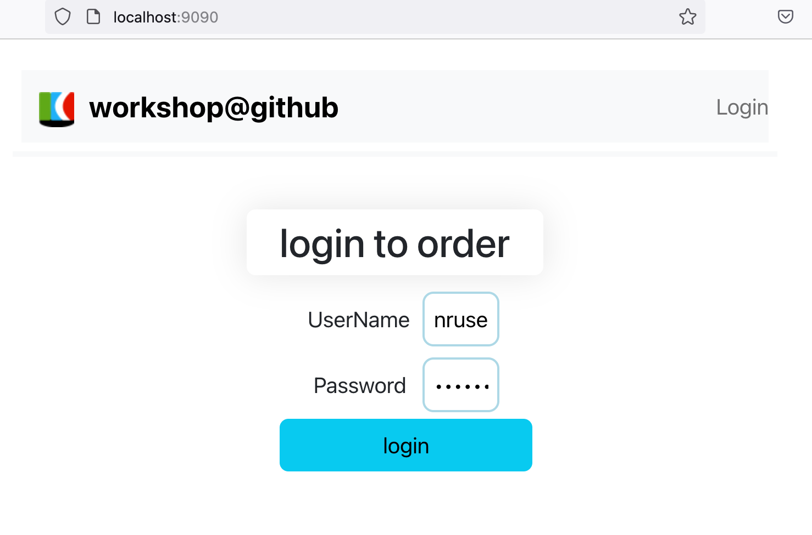

### Clone the lab repository to your local machine
```Shell
git clone https://github.com/haihongren/instrumentation_workshop

```
### Build the project
```
cd instrumentation_workshop
 ./gradlew clean build
```
### Start Kafka and MySQL with Docker-Compose
**make sure your `Docker Desktop` is alreay running**  

In `instrumentation_workshop` folder,  
```
docker-compose -f docker/docker-compose.yml up -ds
```

**verify the docker container are running**
```
docker-compose -f docker/docker-compose.yml ps
```
```
  Name                Command             State                              Ports
--------------------------------------------------------------------------------------------------------------
kafka       /etc/confluent/docker/run     Up      0.0.0.0:9092->9092/tcp,:::9092->9092/tcp
mysql8      docker-entrypoint.sh mysqld   Up      0.0.0.0:3306->3306/tcp,:::3306->3306/tcp, 33060/tcp
zookeeper   /etc/confluent/docker/run     Up      0.0.0.0:2181->2181/tcp,:::2181->2181/tcp, 2888/tcp, 3888/tcp

```

### Configure your New Relic License key 
In `instrumentation_workshop` folder
```
echo 'export NEW_RELIC_LICENSE_KEY="<YOUR LICENSE KEY>"'> env
```

#### Start the apps 
In `instrumentation_workshop` folder
```
./inst_apps.sh start all
```
```
#check status 
./inst_apps.sh status all
```
```
   couponService is running.
   fulfilmentService is running.
   inventoryService is running.
   orderService is running.
   SPAServer is running.
```

#### Interact with the frontend in web browser
```
http://localhost:9090

```



### Stop/restart/status the apps
In `instrumentation_workshop` folder
```
./inst_apps.sh status all
./inst_apps.sh stop all
./inst_apps.sh restart all
./inst_apps.sh  (Enter to see usage) 
```

