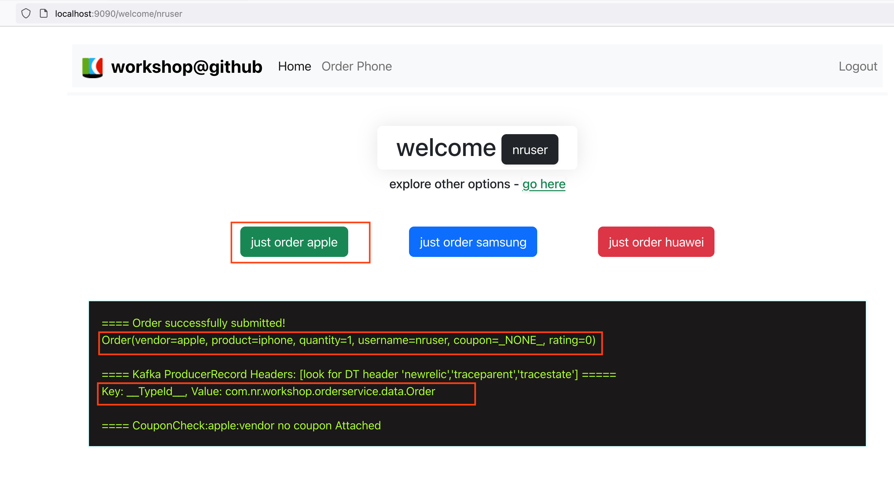
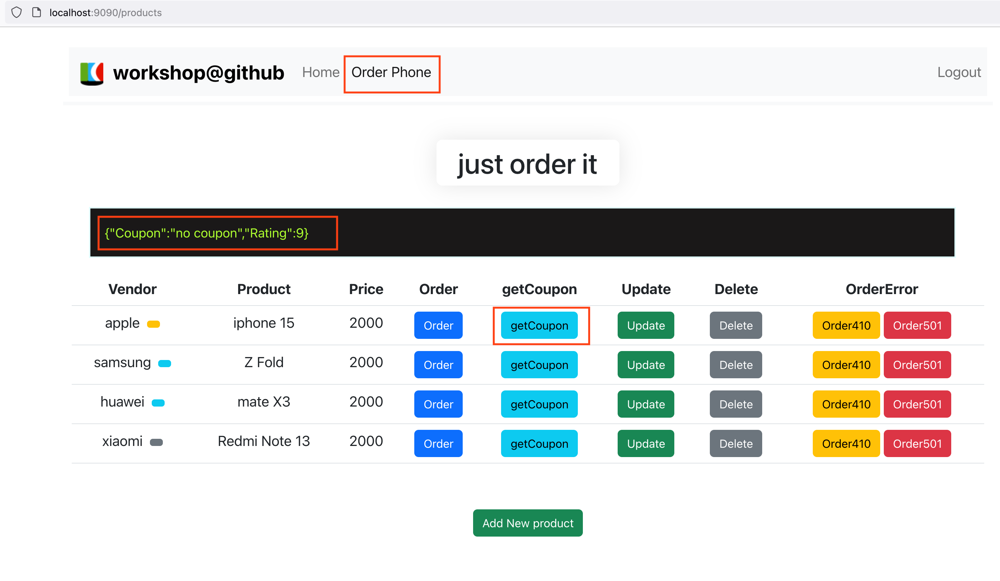
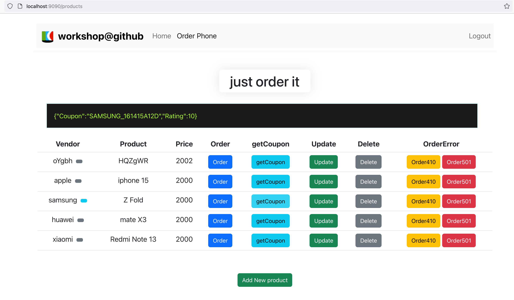
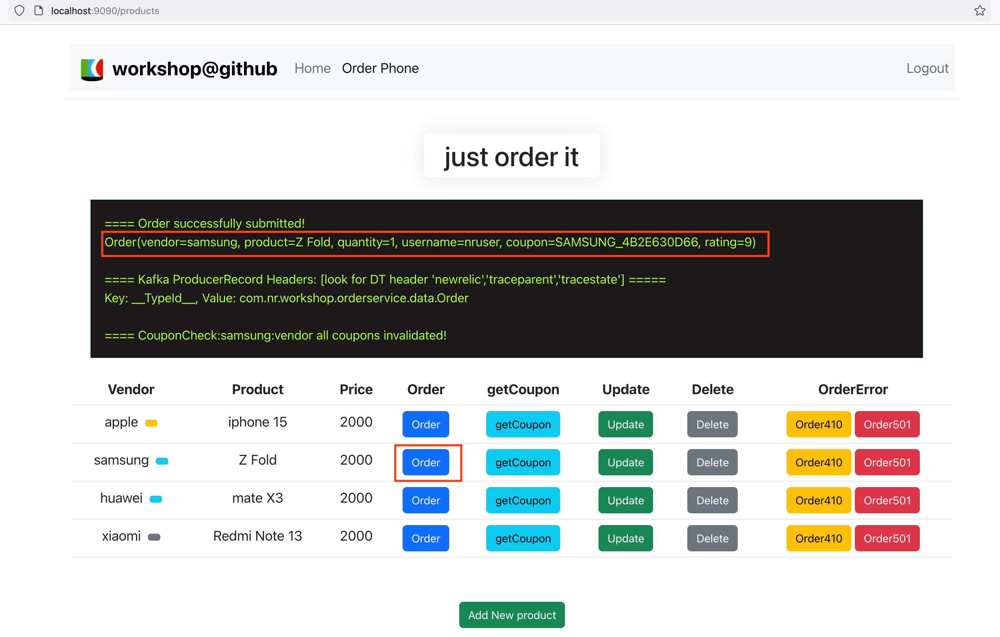
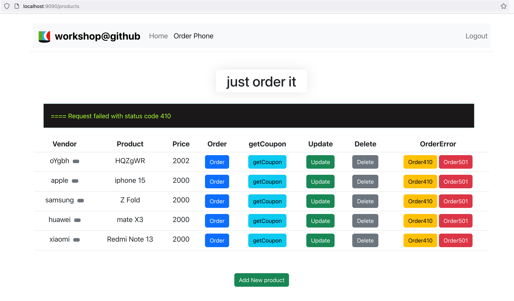
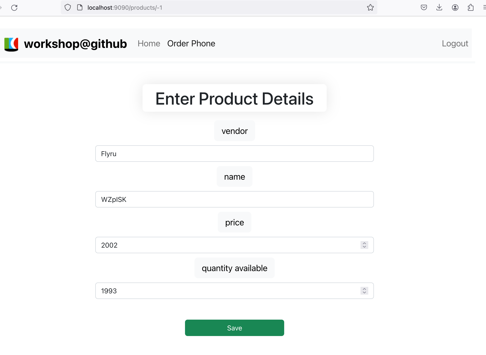
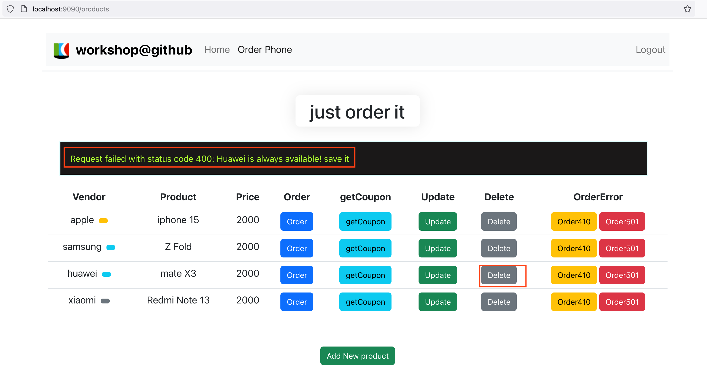

### Login to Frontend SPA app
```
http://localhost:9090
```
| username      | password |
| ----------- | ----------- |
| nruser      | abc123       |
| demouser   | abc123        |
| testuser   | abc123        |
| admin   | abc123        |


### Home -> Order Operation 
- Click "just order apple", or "just order samsung" or "just order huawei"
- The order should be successful similiar to the below screenshot. 
- Check the `response` in the black message box,  check `Order` details and the `Key`(Kafka Headers). 
- There should not be DT headers until producer is instrumented with Java agent later.


### Order Phone -> getCoupon operation
- Click "getCoupon" for `apple`. It should return "no coupon"(couponService app will generate error) and a random rating between 7-9.
- Click "getCoupon" for other vendors. It should return a coupon and a random rating between 7-9. 



### Order Phone -> order operation with coupon
- Click "order" for `samsung`. It should be successful with `coupon` attached to the order along with other details. 
- The Kafka message does not have DT headers at this time. 



### Order Phone -> order operation with error code 410 and 501
- Click "order410" and  "order501" to generate http error code 410 and 501 code for orderService and inventorySerivce. 


### Order Phone -> update/delete/Add new product 
- Preloaded product vendors `apple`, `samsung` and `huawei` allow updating, but cannot be deleted.
- Newly added product can be deleted, updated. 
- Newly added products won't persist between application restart.
- Those CRUD operations will generate backend MySQL Database operations.   

**add new product**


**delete product**

